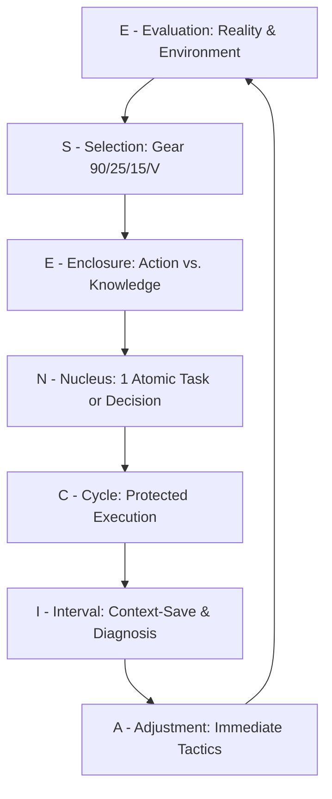

# ESENCIA v202601
**Agnostic Personal Navigation & Cognitive Load Management Framework**

**Author:** Sergio Romano

**Version:** 202601  

**License:** MIT

---

## 1. What is ESENCIA Framework?

**ESENCIA** is a personal navigation meta-framework designed to manage cognitive load and decision-making in high-complexity environments. Unlike traditional productivity systems, ESENCIA operates as a **biological operating system**: it synchronizes your energy levels, environmental context, and intellectual growth so that productivity becomes a byproduct of your state of presence and clarity, rather than a forced effort.

---

## 2. Impact & Benefits: The Promise of ESENCIA

* **Cognitive Sustainability:** Protects your prefrontal cortex by preventing metabolic burnout.
* **Chaos Resilience:** Adaptive gears ensure the system adjusts but never breaks under entropy.
* **Intellectual Capital:** Guarantees exponential growth through the compound interest of knowledge.
* **Strategic Clarity:** Transforms reactive execution into a series of conscious, atomic decisions.
* **Neural Protection:** Minimizes attention residue and trains focus through analog support systems.

---

## 3. The Operational Cycle (Workflow)



1. E — **Evaluation:** Analyze reality (Weather, noise, internal energy).
2. S — **Selection:** Choose the appropriate Gear **(90 / 25 / 15 / V)**.
3. E — **Enclosure:** Decide the mode: **Action** (Building) or **Knowledge** (Expanding).
4. N — **Nucleus:** Define a single atomic goal (or the expected outcome of a meeting).
5. C — **Cycle:** Deliberate and protected execution.
6. I — **Interval:** **Context-Save** + Signal **Diagnosis**.
7. A — **Adjustment:** Strategic decision for the next block.

## 4. Architecture: The Gears and Their Origins
The framework uses timeframes based on chronobiology to maximize performance without draining biological "hardware."

|Gear|Duration|Scientific/Theoretical Basis|Purpose|
|----|--------|----------------------------|-------|
|Maestro|90 min|**BRAC Cycles (Kleitman):** The biological limit of sustained attention.|Deep Work / Architecture / Total focus|
|Standard|25 min|**Pomodoro Pulse:** Optimal time for high intensity with lower fatigue.|Dynamic tasks / Maintenance.|
|Micro-Sprint|15 min|**Minimum Static Friction:** Threshold to overcome procrastination.|Survival / Discipline during crisis or fatigue.|
|Variable (V)|X min|**Event-Driven:** Adaptation to external timeframes.|"Meetings, Syncs, External constraints."|

## 5. The 2:1 Rule & Mathematics of Compound Interest
The 2:1 Rule (Maximum 2 Action blocks per 1 Knowledge block) is the engine of your **Intellectual Compound Interest**.

### A. The "Growth Floor" (Essential Minimum)
Even under the most chaotic conditions, using the Micro-Sprint (15 min) gear ensures inertia:

```
15 min/day x 5 days/week x 50 weeks/year = 3,7530 min ≈ 62.5 hours/year
```

### B. The Exponential Jump (Proactive Use)
As you optimize your energy and use higher-capacity gears **(25 min or 90 min)** for your Knowledge blocks, growth skyrockets:
* **Standard Gear (25 min):** ≈ 104 hours/year
* **Maestro Gear (90 min):** A single weekly block adds 75 extra hours/year of technical or philosophical depth.

### C. Knowledge Synergy
Unlike other assets, knowledge is synergistic and accumulates non-linearly:

```
ESENCIA’s Synergy Law: K(A) + K(B) --> K(C)
```

Each block of knowledge expands your neural network, making **future action blocks faster, more precise, and more valuable**. Today's learning is the efficiency of all your "tomorrows."

## 6. Physical Support: Notebook Format
ESENCIA prioritizes the physical notebook (A5) to activate the **Reticular Activating System (RAS)** and reduce digital eye strain.

```markdown
# [ ] | Time: __:__
S: [ 90 / 25 / 15 / V:__ ] | E: [ Action / Knowledge ]
N (Nucleus): _______________________________________

I (Context-Save): __________________________________
Check: [ C:__ | F:__ | E:__ ]
A (Adjustment): ____________________________________
```

## 7. Signal Diagnosis Table (Extensible)

|Category|Code|Definition|
|--------|----|----------|
|Cognitive|Loop|Processing information without assimilation (re-reading).|
|Cognitivo|Error|Degradation of precision or logic (syntax/strategic errors).|
|Physical|Reset|"Motor or mental fatigue (yawning, heavy eyelids)."|
|Physical|ES|Environmental Stress (Extreme weather variables: Heat/Cold).|
|Emotional|Friction|Reactivity or irritability toward the environment.|

## 8. Theoretical Framework: The Pillars

1. **Ultradian Rhythms (Nathaniel Kleitman):** ~90-minute cycles that govern energy and alertness in wakefulness. ESENCIA respects these peaks to avoid synaptic fatigue.
2. **Structural Tension (Robert Fritz):** Creating structures that make progress the path of least resistance against procrastination.
3. **Intellectual Compound Interest:** The premise that small daily improvements in knowledge multiply as they connect.
4. **Interleaving:** A learning technique that alternates topics to improve long-term retention and mental agility.

## 9. Glossary

* **Context-Save:** A quick record of your mental state before closing a block to allow for a "hot restart" and mitigate attention residue.
* **Environmental Stress (ES):** Cognitive performance degradation caused by extreme environmental variables (e.g., Thermal Throttling).
* **Cognitive Static Friction:** The initial mental resistance when starting a new task. The 15-min gear is designed to break it.
* **Attention Residue:** Fragments of focus that remain "trapped" in a previous task after a context switch.

## 10. FAQ

**When should I NOT apply ESENCIA?**

ESENCIA is an exoskeleton for the will. It should not be applied during moments that require **pure presence** (leisure, family, rest). The goal is not to mechanize areas of life that are outside the scope of development. Use the system to optimize effort so you can deactivate it completely during your life blocks.

**What happens with meetings?**

Use the Variable Gear (V). Define the duration and the expected outcome (Nucleus) before starting. Upon completion, close with a **Context-Save** to clear your mind.

**Why is the 2:1 Knowledge rule mandatory?**

Because mechanical work without intellectual expansion leads to burnout and obsolescence. Knowledge is the fuel that keeps "Action" valuable.

## 11. Revision Period
Beyond the daily tactical adjustment, ESENCIA proposes weekly or monthly reviews to ensure that daily discipline is building the projected future version of yourself. The metric is not the number of tasks, but the quality of your **Essence** at the end of each cycle.

## 12. Author’s Note
If you had the opportunity to change something in your life today, what would it be? Your time, your habits, your knowledge, your way of doing things, the place where you are?
Perhaps this is the chance to do something different, to make a decision toward the version of yourself you aspire to be. This framework doesn't promise to change your life overnight, but it does promise to do it step by step. It starts with becoming aware that knowledge, order, discipline, self-awareness, presence, and mental clarity can be proactive rather than reactive to your surroundings.
Give an opportunity to something that will connect you with your true **ESENCIA**.

**Authorship**
**Created by:** Sergio Romano

**Location:** San Miguel de Tucumán, Argentina.

**Vision:** Working step by step today for a tomorrow with greater clarity, discipline, and purpose.
